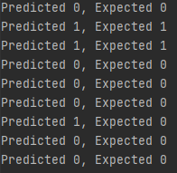

# Aufgabe
Aufgabe war es, für mein ausgewähltes Dataset [Wisconsin Breast Cancer](https://www.kaggle.com/uciml/breast-cancer-wisconsin-data) einen KNN-Algorithmus zu implementieren.  
Die Implementierung hierfür findet man unter [KNN](KNN.py).   
Unter [breast-cancer.py](breast-cancer.py) wird das breast-cancer Dataset geladen, 80% der Daten werden zum Trainieren, die anderen 20% zum testen des Algorithmus verwendet. 

Zur Recherche, wie man einen solchen Algorithmus implementieren kann, habe ich mir von verschiedenen Webseiten einige Teile übernommen.  
Auflistung:  
    *https://machinelearningmastery.com/tutorial-to-implement-k-nearest-neighbors-in-python-from-scratch/  
    *https://github.com/scikit-learn/scikit-learn/blob/master/sklearn/neighbors/_classification.py  
    *https://www.geeksforgeeks.org/ml-kaggle-breast-cancer-wisconsin-diagnosis-using-knn/

### Ergebnis  
Der "vorrausgesagte" Wert 1 entspricht Malignant (=schlecht verlaufend), 0 Benign (=gut verlaufend)
Ausgabe:   
