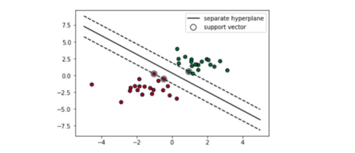
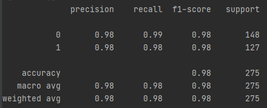

# Aufgabe

Bei dieser Aufgabe sollte mithilfe der scikit-learn Bibliothek ein Machine-Learning Algorithmus "implementiert" werden.

## Dataset 
https://archive.ics.uci.edu/ml/datasets/banknote+authentication  

Die Daten wurden aus Bildern extrahiert, die von echten und 
gefälschten banknotenähnlichen Exemplaren aufgenommen wurden. 
Für die Digitalisierung wurde eine Industriekamera verwendet, 
die normalerweise für die Druckprüfung eingesetzt wird. Die endgültigen Bilder haben 400x 400 Pixel. Aufgrund des Objektivs und der Entfernung zum untersuchten Objekt wurden Graustufenbilder mit einer Auflösung von etwa 660 dpi gewonnen. Zur Extraktion von Merkmalen aus den Bildern wurden Wavelet-Transformation verwendet.

Bei diesem Dataset werden die Merkmale aus der Wavelet-Transformation hergenommen, um zu klassifizieren, ob es sich um eine echte oder eine gefälschte Banknote handelt.   

###Implementierung  

Zur Klassifizierung der Daten wurden Support Vector Machines (SVM) verwendet.  

SVM versucht, zusammengehörige Daten abzugrenzen. Im einfachen Fall wird dabei eine lineare Linie gezogen, die eine Gruppe von einer anderen Gruppe trennt. 
Oft ist dabei ein Problem, dass die Abgrenzung nicht linear erfolgen kann. Dies wird dann mit sog. Kernel-Tricks gelöst, wobei der Objektbereich um zusätzliche Dimensionen (Hyperebenen) erweitert. 

## Ergebnis  
Mittels Sklearn kann direct die "precision", 
also die Genauigkeit, wie hoch der Anteil der richtig
vorrausgesagten Klassifizierungen an den Gesamt zu 
klassifizierenden Daten war.

#### Quellen

https://towardsdatascience.com/support-vector-machine-simply-explained-fee28eba5496
https://www.bigdata-insider.de/was-ist-eine-support-vector-machine-a-880134/
